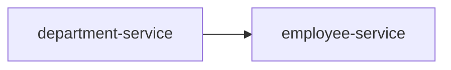

# HTTP Interface 설정

스프링부트가 6.x.x 버전으로 올라가면서, 서비스간 통신을 위해 `HTTP Interface` 라는 새로운 인터페이스가 도입되었다. 
k8s 환경 등에서 어플리케이션 간 HTTP 통신을 위해 OpenFeign 등이 사용되었는데, 동일한 기능을 하는 모듈을 스프링부트에 내장시키려고 노력한 것 같다.

JPA 의 트랜잭션을 떠올리면 쉬울 것 같다. 기존 코드는 그대로 두고 HTTP 를 주고받기 위해 ***프록시***를 생성해서 사용한다.


상황은 다음과 같다.

- 비즈니스 로직을 담고 있는 어플리케이션은 유레카 서버에 등록되어 있다.
- department 에서 employee 컨트롤러로 http 요청을 보내서 데이터를 받아온다.

이를 위해서 다음과 같은 2가지가 필요하다.

- HTTP Exchange 를 위한 인터페이스 생성
- 해당 인터페이스를 Bean 으로 등록

하나씩 살펴보자.

## HTTP Exchange 를 위한 인터페이스 생성

```java
@HttpExchange
public interface EmployeeClient {

    @GetExchange("/employee/department/{departmentId}")
    List<Employee> findByDepartment(@PathVariable("departmentId") Long id);
    
}
```

`@GetExchange`, `@PostExchange` 등 web-mvc 와 유사하다. 다만, `webflux` 기반으로 작동하는 것을 기억해두자. 
webflux 는 js 의 fetch, axios 와 같이 non-blocking 처리를 위해 도입된 모듈이다. 그렇기에 redis 등 다른 서비스를 연동할 때, spring-reactive 관련 오류가 날 가능성이 있다. 
또한 Mono, Body 등 사용법이 web-mvc 와 조금 달라서 적응이 필요할 수 있다.

## 생성한 인터페이스 등록

> 프록시를 생성해서 등록해야한다. 걱정하지 말자. 이미 코드는 다 구현되어 있고 가져다가 쓰기만 하면 된다.

일단 코드부터 살펴보자.
```java
@Configuration
@RequiredArgsConstructor
public class WebClientConfig {

    /*
     * 부하 분산을 위한 필터 추가
     * */
    private final LoadBalancedExchangeFilterFunction filterFunction;

    @Bean
    public WebClient employeeWebClient() {
        return WebClient.builder()
            // employee-service 는 해당 앱에서 spring.application.name 에 설정한 값이다.
            .baseUrl("http://employee-service")
            // 로드 밸런싱을 위한 필터를 추가한다.
            .filter(filterFunction)
            .build();
    }

    @Bean
    public EmployeeClient employeeClient() {
        HttpServiceProxyFactory httpServiceProxyFactory
            = HttpServiceProxyFactory
            .builder(
                WebClientAdapter.forClient(employeeWebClient())
            )
            .build();

        return httpServiceProxyFactory.createClient(EmployeeClient.class);
    }

}
```

- WebClient 객체를 생성한 다음
- HttpServiceProxyFactory 에 해당 WebClient 를 등록한다.
- 해당 인터페이스 의존성을 주입받고 사용한다.


다만, `LoadBalancedExchangeFilterFunction` 가 정확히 이해가 안가서 디버깅을 통해 몇 가지를 알 수 있었다. (RestTemplate 설정 시에는 @LoadBalanced 어노테이션을 사용할 수 있다.)


ProxyFactory 에서 프록시를 생성하며 여러 설정들을 붙인다. 

아래 코드는 filter 를 등록하는 과정 중 일부이다. 
```java
public class ReactorLoadBalancerExchangeFilterFunction implements LoadBalancedExchangeFilterFunction {
    // ...
    @Override
    public Mono<ClientResponse> filter(ClientRequest clientRequest, ExchangeFunction next) {
        // ...
        // ...
        return choose(serviceId, lbRequest).flatMap(lbResponse -> {
            ServiceInstance instance = lbResponse.getServer();
            if (instance == null) {
                // ...
            }
            // ...
            LoadBalancerProperties.StickySession stickySessionProperties = loadBalancerFactory.getProperties(serviceId)
                .getStickySession();
            ClientRequest newRequest = buildClientRequest(clientRequest, instance,
                stickySessionProperties.getInstanceIdCookieName(),
                stickySessionProperties.isAddServiceInstanceCookie(), transformers);
            supportedLifecycleProcessors.forEach(lifecycle -> lifecycle.onStartRequest(lbRequest, lbResponse));
            return next.exchange(newRequest)
                .doOnError(throwable -> supportedLifecycleProcessors.forEach(lifecycle -> lifecycle
                    .onComplete(new CompletionContext<ResponseData, ServiceInstance, RequestDataContext>(
                        CompletionContext.Status.FAILED, throwable, lbRequest, lbResponse))))
                .doOnSuccess(clientResponse -> supportedLifecycleProcessors.forEach(
                    lifecycle -> lifecycle.onComplete(new CompletionContext<>(CompletionContext.Status.SUCCESS,
                        lbRequest, lbResponse, new ResponseData(clientResponse, requestData)))));
        });
    }
    // ...
    protected Mono<Response<ServiceInstance>> choose(String serviceId, Request<RequestDataContext> request) {
        ReactiveLoadBalancer<ServiceInstance> loadBalancer = loadBalancerFactory.getInstance(serviceId);
        if (loadBalancer == null) {
            return Mono.just(new EmptyResponse());
        }
        return Mono.from(loadBalancer.choose(request));
    }
}
```

그리고 결국, `ReactiveLoadBalancer` 인터페이스에 의해 `DefaultRequestContext` 에 저장되어 사용된다. webflux 사용해본 경험이 적어 아직 낯설지만 java 를 기반으로 비동기 통신을 위해 노력한 수많은 흔적을 찾아볼 수 있었다.

```java
public interface ReactiveLoadBalancer<T> {

    /**
     * Default implementation of a request.
     */
    Request<DefaultRequestContext> REQUEST = new DefaultRequest<>();
}
```